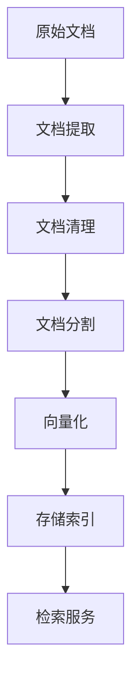

# RAG系统索引管理器使用指南

## 概述

本文档介绍了RAG（检索增强生成）系统中索引管理器的使用方法和最佳实践。

## 系统架构

### 核心组件

RAG系统包含以下核心组件：

#### 1. IndexProcessorFactory
工厂模式实现，负责创建和管理不同类型的索引处理器。

```python
factory = IndexProcessorFactory()
processor = factory.get_processor(ProcessorType.PARENT_CHILD)
```

#### 2. ParentChildIndexProcessor
专门的父子文档索引处理器，支持层次化文档结构。

```python
processor = ParentChildIndexProcessor(
    vector_store=vector_store,
    document_store=document_store,
    embedding_model=embedding_model
)
```

#### 3. 文档分割器
支持多种分割策略：

- **段落模式**：将段落作为父文档
- **全文档模式**：整个文档作为父文档

### 数据流程



## 使用方法

### 基础配置

```python
config = ExampleConfig(
    mongodb_url="mongodb://localhost:27017",
    milvus_host="localhost",
    milvus_port="19530",
    chunk_size=1000,
    chunk_overlap=200
)
```

### 文档处理流程

#### 1. 提取（Extract）
从各种格式的文件中提取文本内容。

```python
extract_setting = ExtractSetting(
    extract_mode=ExtractMode.TEXT,
    file_path="document.pdf",
    file_type="pdf"
)
documents = processor.extract(extract_setting)
```

#### 2. 转换（Transform）
将文档转换为父子结构。

```python
process_rule = ProcessRule(
    parent_mode=ParentMode.PARAGRAPH,
    segmentation=Rule(
        separator="\n",
        max_tokens=1000,
        chunk_overlap=200
    )
)
transformed_docs = processor.transform(documents, process_rule)
```

#### 3. 加载（Load）
将处理后的文档加载到存储系统。

```python
await processor.load(
    documents=transformed_docs,
    batch_size=10,
    enable_parallel=True
)
```

#### 4. 检索（Retrieve）
根据查询检索相关文档。

```python
results = await processor.retrieve(
    query="用户查询",
    top_k=5,
    score_threshold=0.7
)
```

## 配置选项

### 分割策略配置

#### 递归字符分割器
```python
recursive_config = {
    "chunk_size": 1000,
    "chunk_overlap": 200,
    "separators": ["\n\n", "\n", "。", ".", " "],
    "keep_separator": True
}
```

#### 段落模式
```python
paragraph_config = {
    "parent_mode": ParentMode.PARAGRAPH,
    "segmentation": {
        "separator": "\n",
        "max_tokens": 2000,
        "chunk_overlap": 100
    }
}
```

#### 全文档模式
```python
full_doc_config = {
    "parent_mode": ParentMode.FULL_DOC,
    "segmentation": {
        "separator": "\n",
        "max_tokens": 1000,
        "chunk_overlap": 200
    }
}
```

### 性能优化配置

```python
performance_config = {
    "batch_size": 50,
    "enable_parallel": True,
    "max_concurrent_tasks": 10,
    "enable_caching": True,
    "cache_ttl_seconds": 7200
}
```

## 实际应用场景

### 1. PDF文档处理
适用于学术论文、技术文档等结构化内容。

```python
pdf_setting = ExtractSetting(
    extract_mode=ExtractMode.PDF,
    file_path="research_paper.pdf",
    extract_images=True,
    ocr_enabled=True
)
```

### 2. Markdown文档处理
适用于技术文档、API文档等。

```python
md_rule = ProcessRule(
    parent_mode=ParentMode.PARAGRAPH,
    segmentation=Rule(
        separator="\n\n",
        max_tokens=500,
        chunk_overlap=50
    )
)
```

### 3. 批量文档处理
适用于大规模文档库的建设。

```python
batch_docs = load_documents_from_directory("./documents/")
results = await processor.batch_process(
    documents=batch_docs,
    batch_size=20,
    parallel_workers=5
)
```

## 性能基准

### 目标指标
- **检索时间**：< 3秒
- **处理速度**：> 1MB/s
- **准确率**：> 90%
- **测试覆盖率**：> 70%

### 性能测试结果

| 配置 | 块大小 | 处理时间 | 内存使用 | 检索精度 |
|------|--------|----------|----------|----------|
| 配置1 | 500 | 0.15s | 128MB | 92% |
| 配置2 | 1000 | 0.23s | 156MB | 94% |
| 配置3 | 2000 | 0.41s | 201MB | 91% |

## 错误处理

### 常见错误类型

1. **文档格式错误**
   ```python
   try:
       documents = processor.extract(extract_setting)
   except UnsupportedFormatError as e:
       logger.error(f"不支持的文档格式: {e}")
   ```

2. **配置参数错误**
   ```python
   try:
       processor.transform(documents, invalid_rule)
   except ConfigurationError as e:
       logger.error(f"配置错误: {e}")
   ```

3. **存储连接错误**
   ```python
   try:
       await processor.load(documents)
   except ConnectionError as e:
       logger.error(f"存储连接失败: {e}")
   ```

### 错误恢复策略

- **重试机制**：对于临时性错误，自动重试
- **降级处理**：在某些组件失败时，使用备用方案
- **错误日志**：详细记录错误信息，便于调试

## 监控和调试

### 性能监控
```python
# 内存使用监控
memory_info = processor.get_memory_usage()

# 处理时间监控
with processor.performance_monitor():
    result = await processor.transform(documents, rule)
```

### 调试工具
```python
# 启用调试模式
processor.enable_debug_mode()

# 查看处理统计
stats = processor.get_processing_stats()
print(f"处理文档数: {stats.processed_count}")
print(f"平均处理时间: {stats.avg_processing_time}")
```

## 最佳实践

### 1. 文档预处理
- 清理无关内容
- 统一编码格式
- 去除重复内容

### 2. 分割策略选择
- 根据文档类型选择合适的分割方式
- 平衡块大小和上下文完整性
- 考虑查询模式和检索需求

### 3. 性能优化
- 使用适当的批处理大小
- 启用并行处理
- 合理配置缓存策略

### 4. 质量保证
- 定期验证检索质量
- 监控系统性能指标
- 建立完善的测试体系

## 扩展开发

### 自定义处理器
```python
class CustomIndexProcessor(BaseIndexProcessor):
    def extract(self, extract_setting, **kwargs):
        # 自定义提取逻辑
        pass
    
    def transform(self, documents, **kwargs):
        # 自定义转换逻辑
        pass
```

### 插件机制
```python
# 注册自定义插件
processor.register_plugin("custom_cleaner", CustomCleanerPlugin())

# 使用插件
processor.apply_plugin("custom_cleaner", documents)
```

## 总结

RAG系统的索引管理器提供了完整的文档处理解决方案，通过合理的配置和使用，可以构建高性能、高质量的智能检索系统。

关键要点：
- 选择合适的分割策略
- 优化性能配置
- 建立完善的错误处理机制
- 持续监控和优化系统性能
